# Oversteek simulator
# Table of contents
1. [Inleiding](#Inleiding)
2. [Korte samenvatting](#Korte-samenvatting)
3. [Installatie](#Installatie)
4. [Verloop simulatie](#Verloop-simulatie)
5. [Observaties, acties en beloningen](#Observaties-acties-en-beloningen)
6. [Beschrijving objecten](#beschrijving-objecten)
7. [Scripts](#Scripts)
8. [Beschrijving gedragingen objecten](#beschrijving-gedragingen-objecten)
9. [Verloop van de training](#verloop-van-de-training)
10. [Resultaten training](#resultaten-training)

## Inleiding
In dit document zal u een goede uitleg over het project krijgen en wat we hier allemaal in gedaan hebben en hoe alles in werking gegaan is. 

## Korte samenvatting
Voor dit project hebben wij geopteerd om een VR omgeving te maken waarin kinderen zullen kunnen leren om veilig de straat over te steken en hoe ze deze situaties moeten interpreteren.

Hier zullen de autos volledig door een getrainde AI worden bestuurd om zo echte bestuurders te simuleren.

In dit document zal u een korte uitleg krijgen over hoe het project werkt.

## Installatie
- Unity V2019.4.16f1
- ML Agents V1.0.5
- Oculus XR plugin V1.6.1
- Unity asset: Character Pack Free Sample

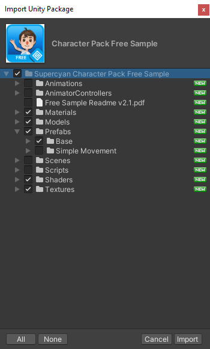

## Verloop simulatie
Wanneer de simulatie start zal de speler een random positie toegekend krijgen. 
Op dit moment zullen er ook auto's beginnen verschijnen die op de weg rijden 

## Observaties, acties en beloningen

### Beloning structuur
Voor onze beloningen hebben we verschillende tabellen aangezien we met meerde AI agents zullen werken en hierdoor zal elke agent ook een specifieke reward structure hebben.
|Agent          |Rijdt tegen speler   |Komt op bestemming   |Rijdt te snel   |Niet op bestemming   |Raakt auto          |
|---            |---                  |---                  |---             |---                  |---                 |
|Goede auto     |-1                   |+1                   |-0.1            |-0.001               |-0.8                |
|Slechte auto   |-0.5                 |+1                   |-0.1            |-0.002               |-0.8                |
|Player         |NVT                  |+1                   |NVT             |-0.001               |-1                  |

## Beschrijving objecten
### Auto
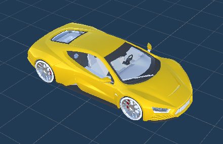

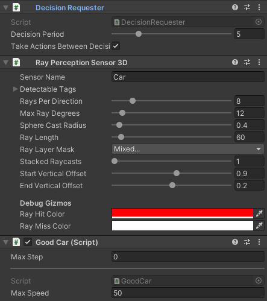

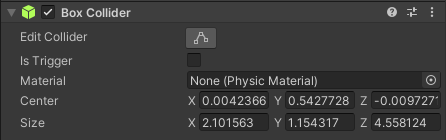

Aan de auto werd een ray perception sensor, Decision requester en het good car script toegevoegd.
Zorg ook zeker dat de box collider verandert word zodat deze de auto goed encapsuleert.

Bij de 2de auto prefab zien we dat er een bad car script aan toegevoegd werd.
De settings voor alle 2 de auto's zijn compleet hetzelfde enkel het aangevoegd script (Goodcar, Badcar) verandert.

### Player
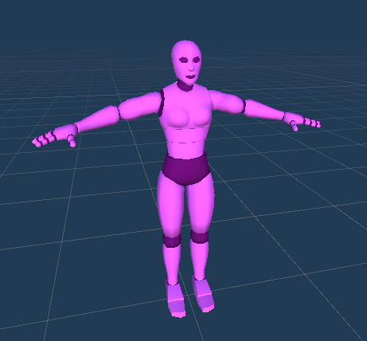

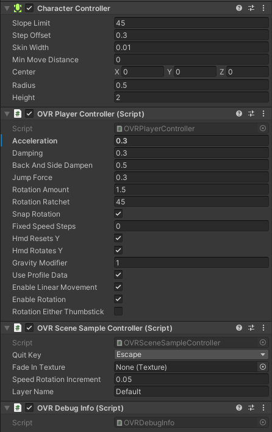

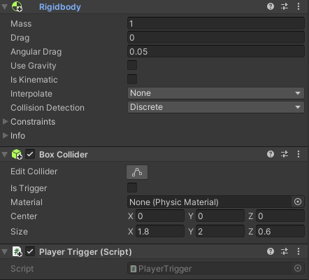

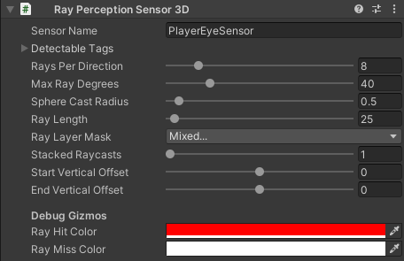


Bij de speler zien we dat er ray perception word toegevoegd in empty game objects om zo het peripheraal zicht na te bootsen.

Alsook moet er op het player object zelf ook nog de box collider worden aangepast en de nodige scripts toegevoegd Bvb: `OVR Player controller`

### Pedestrian Crossing
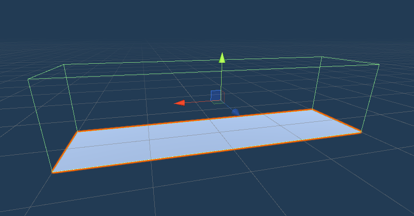

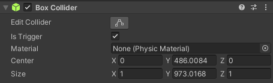

Hier zien we een streep van het zebrapad waar de speler over zal kunnen wandelen. Daarboven kan een box collider geobserveerd worden die bovenop de streep hangt zodat we kunnen controleren wanneer  er verschillende entities in contact komen met het zebrapad.

### Scene
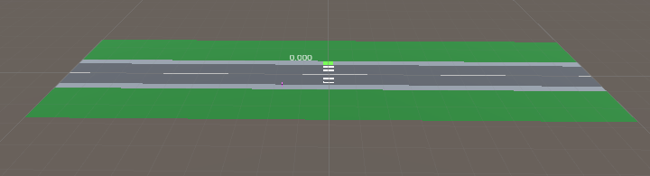

In deze foto kunnen we zien dat er een basisscene opgesteld is waarop we een zebrapad, voetgangerspad en een weg kunnen observeren. We hebben bewust gekozen om de scene basic te houden om zo meer op de functionaliteit te kunnen letten waardoor we meer vooruitgang konden boeken.
## Scripts
#### Car
```C#
public abstract class Car : Agent
{
    public float maxSpeed = 50f;

    internal Rigidbody rb;
    internal Environment environment;

    public override void Initialize()
    {
        base.Initialize();
        rb = GetComponent<Rigidbody>();

        InvokeRepeating(nameof(AddNotOnDestinationReward), 0, 1.0f);
        InvokeRepeating(nameof(AddMovesTooFastReward), 0, 1.0f);
    }

    public override void CollectObservations(VectorSensor sensor)
    {
        sensor.AddObservation(transform.localPosition); // 3 observations

        sensor.AddObservation(rb.velocity.x); // 1 observation

        // total: 4 observations
    }

    public abstract void AddNotOnDestinationReward();

    public abstract void AddMovesTooFastReward();

    public override void Heuristic(float[] actionsOut)
    {
        actionsOut[0] = 0f; // don't move

        if (Input.GetKey(KeyCode.UpArrow)) // go forward
        {
            actionsOut[0] = 1f;
        }
        if (Input.GetKey(KeyCode.DownArrow)) // stop
        {
            actionsOut[0] = -1f;
        }
    }

    public override void OnActionReceived(float[] vectorAction)
    {
        if (vectorAction[0] == 1)
        {
            Move();
        }

        if (vectorAction[0] == -1)
        {
            Stop();
        }
    }

    public void Move()
    {
        rb.AddForce(transform.forward * maxSpeed, ForceMode.Acceleration);
    }

    public void Stop()
    {
        rb.AddForce(-0.8f * rb.velocity);
    }

    public abstract void OnCollisionEnter(Collision other);
}
```
#### Good car
```C#
public class GoodCar : Car
{
    public override void AddNotOnDestinationReward()
    {
        AddReward(-0.001f);
    }

    public override void AddMovesTooFastReward()
    {
        if (environment == null)
        {
            environment = GetComponentInParent<Environment>();
        }

        if (environment != null && rb.velocity.x > environment.maxSpeed)
        {
            AddReward(-0.1f);
        }
    }

    public override void OnCollisionEnter(Collision other)
    {
        if (other.gameObject.CompareTag("Player") || other.gameObject.CompareTag("PlayerController"))
        {
            AddReward(-1f);
            Destroy(this.gameObject);
            EndEpisode();
        }
        else if (other.gameObject.tag.Contains("Destination"))
        {
            AddReward(1f);
            Destroy(this.gameObject);
            EndEpisode();
        }
        else if (other.gameObject.CompareTag("Car"))
        {
            AddReward(-0.8f);
            Destroy(other.gameObject);
            Destroy(this.gameObject);
            EndEpisode();
        }
    }
}
```
#### Bad car
```C#
public class BadCar : Car
{
    public override void AddNotOnDestinationReward()
    {
        AddReward(-0.002f);
    }
    
    public override void AddMovesTooFastReward()
    {
        if (environment == null)
        {
            environment = GetComponentInParent<Environment>();
        }
        
        if (environment != null && rb.velocity.x > (environment.maxSpeed + 10))
        {
            AddReward(-0.1f);
        }
    }
    
    public override void OnCollisionEnter(Collision other)
    {
        if (other.gameObject.CompareTag("Player") || other.gameObject.CompareTag("PlayerController"))
        {
            AddReward(-0.5f);
            Destroy(this.gameObject);
            EndEpisode();
        } else if (other.gameObject.tag.Contains("Destination"))
        {
            AddReward(1f);
            Destroy(this.gameObject);
            EndEpisode();
        } else if (other.gameObject.CompareTag("Car"))
        {
            AddReward(-0.8f);
            Destroy(other.gameObject);
            Destroy(this.gameObject);
            EndEpisode();
        }
    }
}
```
#### Environment
```C#
public enum RoadSide
{
    Right,
    Left
}
public class Environment : MonoBehaviour
{
    private const float SPAWN_RANGE_X = 20f;
    private const float SPAWN_RANGE_Z = 14f;
    
    public int maxSpeed = 30;
    public GameObject goodCar;
    public GameObject badCar;
    public GameObject scoreboard;

    private Player player;
    private GameObject playerController;
    private CharacterController c;
    private TextMeshPro _scoreboard;
    private Vector3 initialControllerPosition;
    private Quaternion initialControllerRotation;
    
    internal GameObject cars;


    public void OnEnable()
    {
        player = GetComponentInChildren<Player>();
        playerController = player.transform.FindObjectsWithTag("PlayerController").First();
        c = playerController.GetComponent<CharacterController>();
        _scoreboard = scoreboard.GetComponent<TextMeshPro>();
        initialControllerPosition = playerController.transform.localPosition;
        initialControllerRotation = playerController.transform.localRotation;
        
        cars = transform.Find("Cars").gameObject;
    }

    private void FixedUpdate()
    {
        _scoreboard.text = player.GetCumulativeReward().ToString("f3");
    }

    // bron: https://github.com/ddhaese/Project_ML-Agents_02/blob/master/Assets/Scripts/Environment.cs, lijn 31 - 37
    private Vector3 GetRandomPosition()
    {
        int randomNumber = Random.Range(0, 3);
        
        float x = Random.Range(-SPAWN_RANGE_X, SPAWN_RANGE_X);
        float z = Random.Range(initialControllerPosition.z, SPAWN_RANGE_Z);
        
        if (randomNumber == 0)
        {
            return new Vector3(initialControllerPosition.x, 1f, z);
        }
        
        return new Vector3(x, 1f, initialControllerPosition.z);
    }

    private Quaternion GetRandomRotation()
    {
        // bron: https://github.com/ddhaese/Project_ML-Agents_02/blob/master/Assets/Scripts/Environment.cs, lijn 77
        return Quaternion.Euler(0f, Random.Range(0f, 360f), 0f);
    }

    public void ResetEnvironment()
    {
        foreach (Transform car in cars.transform)
        {
            GameObject.Destroy(car.gameObject);
        }
        
        c.enabled = false;
        c.transform.localPosition = GetRandomPosition();
        c.transform.localRotation = GetRandomRotation();
        c.enabled = true;
    }
}
```
#### Spawnpoint
```C#
public class SpawnPoint : MonoBehaviour
{
    private const float MIN_TIME_START = 0f;
    private const float MAX_TIME_START = 5f;
    private const float MIN_TIME = 2f;
    private const float MAX_TIME = 20f;
    
    public RoadSide roadSide;
    private Environment environment;

    private void Start()
    {
        environment = GetComponentInParent<Environment>();
        float randomTime = Random.Range(MIN_TIME_START, MAX_TIME_START);
        
        Invoke(nameof(Spawn), randomTime);
    }

    public void Spawn()
    {
        if (environment == null)
        {
            environment = GetComponentInParent<Environment>();
        }
        
        int randomNumber = Random.Range(0, 3);
        
        float randomTime = Random.Range(MIN_TIME, MAX_TIME);

        GameObject prefab;

        if (randomNumber == 0)
        {
            prefab = environment.badCar.gameObject;
        }
        else
        {
            prefab = environment.goodCar.gameObject;
        }
        
        Quaternion orientation = Quaternion.Euler(0, 90, 0);;
        if (roadSide == RoadSide.Left)
        {
            orientation = Quaternion.Euler(0, 270, 0);
        }
        
        GameObject car = Instantiate(prefab, new Vector3(transform.localPosition.x, transform.localPosition.y, transform.localPosition.z), orientation);

        car.transform.SetParent(environment.cars.transform, false);
        
        Invoke(nameof(Spawn), randomTime);
    }
}
```
#### Transform Extension
```C# 
/*
     * Source: http://answers.unity.com/answers/1352565/view.html
     */
    public static class TransformExtensions
    {

        public static List<GameObject> FindObjectsWithTag(this Transform parent, string tag)
        {
            List<GameObject> taggedGameObjects = new List<GameObject>();

            for (int i = 0; i < parent.childCount; i++)
            {
                Transform child = parent.GetChild(i);
                if (child.CompareTag(tag))
                {
                    taggedGameObjects.Add(child.gameObject);
                }
                if (child.childCount > 0)
                {
                    taggedGameObjects.AddRange(FindObjectsWithTag(child, tag));
                }
            }
            return taggedGameObjects;
        }

    }
}
```
#### Player trigger
```C#
public class PlayerTrigger : MonoBehaviour
    {
        private Player player;

        private void Start()
        {
            player = GetComponentInParent<Player>();
        }

        void OnTriggerEnter(Collider collision)
        {
            player.OnChildTriggerEnter(collision);
        }

        void OnTriggerStay(Collider collision)
        {
            player.OnChildTriggerStay(collision);
        }

        void OnCollisionEnter(Collision collision)
        {
            player.OnChildCollisionEnter(collision);
        }
    }
}
```
#### Player
```C#
public class Player : Agent
{
    public float movementSpeed = 1;
    public float rotationSpeed = 300;

    private Environment environment;
    private GameObject playerController;
    private CharacterController controller;

    public override void Initialize()
    {
        base.Initialize();
        environment = GetComponentInParent<Environment>();
        playerController = environment.transform.FindObjectsWithTag("PlayerController").First();
        controller = playerController.GetComponent<CharacterController>();
    }

    public override void OnEpisodeBegin()
    {
        SetReward(0);
        environment.ResetEnvironment();
    }

    public override void Heuristic(float[] actionsOut)
    {
        actionsOut[0] = 0f;
        actionsOut[1] = 0f;

        if (Input.GetKey(KeyCode.W))
        {
            actionsOut[0] = 1f;
        }
        if (Input.GetKey(KeyCode.LeftArrow))
        {
            actionsOut[1] = 1f;
        }
        else if (Input.GetKey(KeyCode.RightArrow))
        {
            actionsOut[1] = 2f;
        }

    }

    public override void OnActionReceived(float[] vectorAction)
    {
        if (vectorAction[0] != 0)
        {
            controller.Move(playerController.transform.forward * movementSpeed * Time.deltaTime);
        }

        if (vectorAction[1] != 0)
        {
            AddReward(-0.0005f);
            playerController.transform.Rotate(0, rotationSpeed * (vectorAction[1] * 2 - 3) * Time.deltaTime, 0);
        }
    }

    public void OnChildTriggerEnter(Collider collision)
    {
        if (collision.CompareTag("Finish"))
        {
            AddReward(1);
            EndEpisode();
        }
    }

    public void OnChildTriggerStay(Collider collision)
    {
        if (collision.CompareTag("Grass"))
        {
            AddReward(-0.0001f);
        }
        else if (collision.CompareTag("Road"))
        {
            AddReward(-0.0001f);
        }
    }

    public void OnChildCollisionEnter(Collision collision)
    {
        if (collision.transform.CompareTag("Car"))
        {
            AddReward(-1);
            EndEpisode();
        }
    }
}
```

## Beschrijving gedragingen objecten
### Auto
Bij het gedrag van de auto zien we dat de auto's vooruit zullen rijden om zo aan hun gedesigneerde eindzone te geraken. Indien ze een speler klaar zien staan aan het voetpad zullen de auto's moeten stoppen om zo de speler over te laten. 

Echter hebben we er ook voor gezorgd dat we enkele auto's niet laten stoppen om zo het verkeer het beste te simuleren.
Zo zal de speler kunnen leren omgaan met auto's die zoals in een echte verkeerssituatie niet zullen stoppen.

## Verloop van de training
Om de auto's op een goede manier te trainen hoe het verkeer in het echt zou lopen hebben we geopteerd om de speler ook een agent toe te kennnen tijdens de training. 
Dit zal ervoor zorgen dat wanneer we de training starten de auto's zullen leren om te gaan met een onvoorspelbare speler. 

Om de training te starten kan u in de projectmap een python of anaconda terminal opendoen en daarin zal u de volgende commands moeten invoeren. 

Indien u anaconda gebruikt zal u eerst de omgeving moeten aanzetten. Dit kan u doen door het commando: 
```
conda activate <Naam ML agents environment>
```
Daarna kan u de training starten met het commando: 
```
mlagents-learn YAML --run-id <Naam>
```
Indien u de resultaten van de training wilt bekijken al dan niet live kan u in een nieuwe terminal dit commando uitvoeren: 
```
tensorboard --logdir results
```


In het volgende hoofdstuk zullen we meer uitbreiden over de resultaten die we hebben geobserveerd van onze training.
## Resultaten training