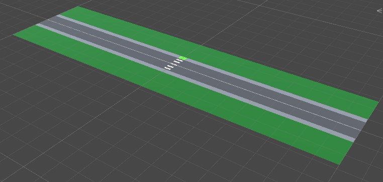

# Oversteek simulator

## Table of contents

- [Oversteek simulator](#oversteek-simulator)
  - [Table of contents](#table-of-contents)
  - [Groepsleden](#groepsleden)
  - [Inleiding](#inleiding)
  - [Korte samenvatting](#korte-samenvatting)
  - [Installatie](#installatie)
  - [Verloop simulatie](#verloop-simulatie)
  - [Observaties, acties en beloningen](#observaties-acties-en-beloningen)
    - [Beloning structuur](#beloning-structuur)
  - [Beschrijving objecten](#beschrijving-objecten)
    - [Auto](#auto)
    - [Spawn Left & Spawn Right](#spawn-left--spawn-right)
    - [Player](#player)
      - [VR Player](#vr-player)
      - [ML Player](#ml-player)
    - [Zebrapad](#zebrapad)
    - [Finish](#finish)
    - [Scene](#scene)
  - [Scripts](#scripts)
    - [Car](#car)
    - [Good car](#good-car)
    - [Bad car](#bad-car)
    - [Environment](#environment)
    - [Spawnpoint](#spawnpoint)
    - [Player](#player-1)
    - [Simple Player](#simple-player)
    - [Transform Extensions](#transform-extensions)
  - [Beschrijving gedragingen objecten](#beschrijving-gedragingen-objecten)
    - [Auto](#auto-1)
    - [Player](#player-2)
  - [Verloop van de training](#verloop-van-de-training)
  - [One-pager](#one-pager)
    - [Spelverloop](#spelverloop)
    - [Meerwaarde](#meerwaarde)
    - [Interactie](#interactie)
    - [Kwadrant](#kwadrant)
  - [Veranderingen ten opzichte van de one-pager](#veranderingen-ten-opzichte-van-de-one-pager)
  - [Resultaten training](#resultaten-training)
    - [Run 2](#run-2)
    - [Run 3](#run-3)
    - [Run 4](#run-4)
    - [Run 8](#run-8)
    - [Run 9](#run-9)
- [Slotwoord](#slotwoord)
  - [Roadblocks](#roadblocks)
  - [Conclusie](#conclusie)
- [Bronnen](#bronnen)

## Groepsleden

| Naam                   | S-nummer |
| ---------------------- | -------- |
| Anne Toussaint         | s106511  |
| Kirishalini Kanagarasa | s108145  |
| Yalda Fazlehaq         | s108051  |
| Kobe De Peuter         | s107571  |
| Matthias Verschorren   | s103579  |

## Inleiding

Voor het vak VR Experience kregen wij de opdracht om een applicatie te bedenken waarbij zowel Virtual Reality als machine learning een meerwaarde zal zijn.
Hiervoor maken we gebruik van Unity.
In dit document zal u een goede uitleg over het project krijgen, wat we hier allemaal in gedaan hebben en hoe alles in zijn werking gegaan is.

Alle code is ook te vinden op de [Github Repository](https://github.com/Toegepase-Informatica-AP/final-assignment-oversteek-simulator).

## Korte samenvatting

Voor dit project hebben wij geopteerd om een VR omgeving te maken waarin kinderen zullen leren om veilig de straat over te steken.
Het is de bedoeling dat ze leren hoe ze veilig kunnen oversteken, zonder enig gevaar.

Hier zullen de auto's volledig door een getrainde AI worden bestuurd om zo echte bestuurders te simuleren.

## Installatie

| Programma/tool/asset  | Versie         |  Naam                        |
| ---                   | ---            | ---                          |
| Unity                 | 2019.4.16f1    |                              |
| Python                | 3.8.1 of hoger |                              |
| ML Agents             | 1.0.5          |                              |
| Tensorboard           | 2.3.1          |                              |
| Oculus XR plugin      | 1.6.1          |                              |
| XR Plugin Management  | 3.2.17         |                              |
| Unity asset           | 2.2.0          | Character Pack Free Sample   |
| Unity asset           | 1.0.0          | HQ Racing Car Model No.1203  |
| Unity asset           | 23.1.0         | Oculus Integration  |

Voor de Unity assets moet het volgende geïmporteerd worden:


## Verloop simulatie

Wanneer de simulatie start zal de speler een random positie en random rotatie toegekend krijgen.
Op dit moment zullen er ook auto's beginnen verschijnen, die op de weg rijden.
De auto's zullen in beide richtingen rijden.

## Observaties, acties en beloningen

### Beloning structuur

Voor onze beloningen hebben we verschillende tabellen aangezien we met meerde AI agents zullen werken en hierdoor zal elke agent ook een specifieke reward structure hebben.

| Agent                 | Rijdt tegen speler    | Komt op bestemming    | Rijdt te snel | Niet op bestemming | Raakt auto   | Afstand tot bestemming | Op verboden locatie                 |
| ---                   | ---                   | ---                   | ---           | ---                | ---          | ---                    | ---                                 |
| Goede auto            | -1\*                  | +1\*                  | -0.1          | -0.001             | -0.8\*       | NVT                    | NVT                                 |
| Slechte auto          | -0.5\*                | +1\*                  | -0.1          | -0.002             | -0.8\*       | NVT                    | NVT                                 |
| Player                | NVT                   | +1\*                  | NVT           | -0.001             | -1*          | variabel               | -0.0001 op gras, -0.0002 op de weg  |
| *Eindigd ook episode  |

## Beschrijving objecten

### Auto


Voor de auto's werd een asset package gebruikt, om ons veel werk te besparen en toch een mooie auto te hebben. Om deze models op een goede grootte te krijgen, hebben we een schaal van 1.5 toegepast. We hebben gekozen voor een verschil in kleur om aan te duiden wat een goede en wat een slechte auto is, dit betekend dat we telkens de twee prefabs moeten aanpassen. Om aan te duiden dat dit effectief een auto is voegen we de Car tag toe.


In het originele object is de collider niet perfect hoe we hem willen, dus verwijderen we het collider object dat in het auto model zit. Zelf voegen we een box collider component toe en veranderen we de grootte zodat die rond de hele auto zit.


Om de training goed te kunnen laten verlopen moeten we de behaviour parameters goed instellen. De behaviour name hangt af van welk script je toevoegt. Beide auto's hebben 4 observations en 1 action branch size met 3 mogelijke waarden. Omdat we nog niets hebben getrained kunnen we nog geen model toevoegen.

Beide auto's hebben een script nodig die de effectieve agent toevoegt. Voor de gele auto hebben we het GoodCar script, voor de blauwe hebben we het BadCar script. Deze twee scripts verschillen enkel in het reward systeem, voor de rest maken ze gebruik van dezelfde code.

Om ervoor te zorgen dat de auto objecten effectief kan zien werd er een ray perception sensor toegevoegd. Het is belangrijk dat de sensor een aantal tags kan detecteren: player, car en crossing. Ook veranderen we het aantal rays, de ray breedte en de ray lengte. Verder willen we dat de sensor een beetje naar beneden kijkt, dus stellen we dit ook in. Om ervoor te zorgen dat we manueel de auto's kunnen besturen voegen we een decision requester toe.

### Spawn Left & Spawn Right

In de scene moeten ook zeker empty gameobjects toegevoegd worden genoemd: SpawnLeft en SpawnRight.

Dit zijn de locaties waar de auto's zullen spawnen, deze empty gameobjects zullen het script Spawn Point moeten krijgen en hier zal zeker de juiste kant van de weg geselecteerd moeten worden. In het script kan u de Road Side kiezen, deze stelt u gewoon in op de kant van de weg waar het empty game object zich bevind.

Let goed op. Spawn Left en Spawn right is relatief tot de rechtse en linkse rijstrook op het baanvak.

### Player

Om problemen te vermijden tussen de machine learning en de effectieve applicatie, hebben we twee aparte speler objecten voorzien.

#### VR Player


In de `Asset/Oculus/VR/Prefabs` bevindt zich de `OVRPlayerController`, deze zullen we gebruiken als basis voor onze speler. Natuurlijk voegen we ook hier weer een tag toe, dit keer Player. Omdat onze applicatie een VR applicatie is, is een model hiervoor niet nodig.


In de componenten die de controller bevat veranderen we enkel de acceleratie zodat we sneller bewegen.


Zelf voegen we nog een rigidbody toe om beweging toe te voegen. Hierbij zetten we gravity uit en zorgen ervoor dat alle X, Y en Z veranderingen uitstaan. Deze zorgen voor ongewenste bijwerkingen. Omdat we enkel x en z bewegingen hebben, is dit geen probleem.

#### ML Player


Ons hoofdobject heeft zelf geen vorm. Het heeft enkel componenten en de Player tag. We voegen een rigidbody toe, ook weer zonder gravity en zetten we de rotatie volledig uit. Voor de gewone beweging zetten we enkel de Y coördinaat uit, zodat we niet door muren kunnen gaan.
Ook voegen we een box collider toe, om ervoor te zorgen dat we aanrakingen kunnen detecteren.


De speler heeft één observatie en twee soorten acties, met telkens twee waarden. Om de speler niet te lang te laten rondlopen, stellen we een limiet van 50.000 stappen op. Ook hier is een decision requester nodig voor manuele beweging.


Voor deze speler maken we gebruik van een asset package. Deze voegen we toe aan ons hoofd object en vergroten we met 1.5.


Aan het model voegen we ook 3 ray perception sensors toe. Twee om rechtdoor te kijken, telkens op een andere hoogte, en één om naar beneden te kijken. De te detecteren tags zijn voor alle drie hetzelfde: Car, Finish, Footpath, Crossing, Road en Grass. Alle sensoren hebben een breedte van 40 graden. Daarnaast hebben we voor elke sensor een aantal waarden veranderd, zodat alles goed detecteerbaar is.

### Zebrapad

Voor het zebrapad hebben we een object met enkel de Crossing tag.


In dat object zitten meerdere witte strepen. Om de detectie te garanteren hebben we een grote box collider toegevoegd zodat we kunnen controleren wanneer er verschillende entities in contact komen met het zebrapad.

### Finish


De finish is een enorm simpel object met de Finish tag en een box collider.  

### Scene



In deze foto kunnen we zien dat er een basisscene opgesteld is waarop we een oversteekpunt, voetgangerspad en een weg kunnen observeren. We hebben bewust gekozen om de scene basic te houden om zo meer op de functionaliteit te kunnen letten waardoor we meer vooruitgang konden boeken.

## Scripts

### Car

```csharp
using Unity.MLAgents;
using Unity.MLAgents.Sensors;
using UnityEngine;

public abstract class Car : Agent
{
    public float maxSpeed = 50f;

    internal Rigidbody body;
    internal Environment environment;

    public override void Initialize()
    {
        base.Initialize();
        environment = GetComponentInParent<Environment>();
        body = GetComponent<Rigidbody>();

        InvokeRepeating(nameof(AddNotOnDestinationReward), 0, 1.0f);
        InvokeRepeating(nameof(AddMovesTooFastReward), 0, 1.0f);
    }

    public override void CollectObservations(VectorSensor sensor)
    {
        // Add current position as observation.
        // 3 observations
        sensor.AddObservation(transform.localPosition);

        // Add current speed as observation.
        // 1 observation
        sensor.AddObservation(body.velocity.x);

        // Total = 4 observations
    }

    public override void Heuristic(float[] actionsOut)
    {
        // Check for input.
        if (Input.GetKey(KeyCode.UpArrow))
            actionsOut[0] = 1f;
        else if (Input.GetKey(KeyCode.DownArrow))
            actionsOut[0] = -1f;
        else
            actionsOut[0] = 0f;

    }

    public override void OnActionReceived(float[] vectorAction)
    {
        // Apply movement.
        if (vectorAction[0] == 1)
            body.AddForce(transform.forward * maxSpeed, ForceMode.Acceleration);
        else if (vectorAction[0] == -1)
            body.AddForce(-0.8f * body.velocity);
    }

    public abstract void OnCollisionEnter(Collision other);

    /// <summary>
    /// Update environment variable based on the current parent.
    /// </summary>
    internal void UpdateEnvironment()
    {
        if (environment == null) environment = GetComponentInParent<Environment>();
    }

    /// <summary>
    /// Reward logic for not being on location yet.
    /// </summary>
    internal abstract void AddNotOnDestinationReward();

    /// <summary>
    /// Reward logic for moving too fast.
    /// </summary>
    internal abstract void AddMovesTooFastReward();
}
```

Car is de superklasse voor GoodCar en BadCar omdat veel van de logica hetzelfde is voor beide klasses. Car erft over van "Agent" omdat dit een AI-component is.

### Good car

```csharp
using UnityEngine;

public class GoodCar : Car
{
    public override void OnCollisionEnter(Collision other)
    {
        if (other.gameObject.CompareTag("Player") || other.gameObject.CompareTag("PlayerController"))
        {
            AddReward(-1f);
            Destroy(this.gameObject);
            EndEpisode();
        }
        else if (other.gameObject.tag.Contains("Destination"))
        {
            AddReward(1f);
            Destroy(this.gameObject);
            EndEpisode();
        }
        else if (other.gameObject.CompareTag("Car"))
        {
            AddReward(-0.8f);
            Destroy(other.gameObject);
            Destroy(this.gameObject);
            EndEpisode();
        }
    }

    internal override void AddNotOnDestinationReward()
    {
        AddReward(-0.001f);
    }

    internal override void AddMovesTooFastReward()
    {
        UpdateEnvironment();

        if (environment != null && body.velocity.x > environment.maxSpeed)
        {
            AddReward(-0.1f);
        }
    }
}
```

GoodCar erft over van Car. Hierin wordt de reward-logica uitgewerkt voor GoodCar.

### Bad car

```csharp
using UnityEngine;

public class BadCar : Car
{
    public override void OnCollisionEnter(Collision other)
    {
        if (other.gameObject.CompareTag("Player") || other.gameObject.CompareTag("PlayerController"))
        {
            AddReward(-0.5f);
            Destroy(this.gameObject);
            EndEpisode();
        }
        else if (other.gameObject.tag.Contains("Destination"))
        {
            AddReward(1f);
            Destroy(this.gameObject);
            EndEpisode();
        }
        else if (other.gameObject.CompareTag("Car"))
        {
            AddReward(-0.8f);
            Destroy(other.gameObject);
            Destroy(this.gameObject);
            EndEpisode();
        }
    }

    internal override void AddNotOnDestinationReward()
    {
        AddReward(-0.002f);
    }

    internal override void AddMovesTooFastReward()
    {
        UpdateEnvironment();

        if (environment != null && body.velocity.x > (environment.maxSpeed + 10))
        {
            AddReward(-0.1f);
        }
    }
}
```

BadCar erft over van Car. Ook hier wordt de reward-logica uitgewerkt, maar specifiek voor BadCar.

### Environment

```csharp
using Assets.Scripts;
using TMPro;
using Unity.MLAgents;
using UnityEngine;
using Random = UnityEngine.Random;

public class Environment : MonoBehaviour
{
    private const float SPAWN_RANGE_X = 45;
    private const float SPAWN_RANGE_Z = 6;

    public int spawnX = 0;
    public int spawnY = 0;
    public int maxSpeed = 30;
    public GameObject goodCar;
    public GameObject badCar;
    public GameObject scoreboard;
    public GameObject finish;

    private GameObject player;
    private TextMeshPro _scoreboard;
    private Vector3 initialPlayerPosition;

    internal GameObject cars;

    public void OnEnable()
    {
        player = transform.GetChildrenByTag("Player").gameObject;
        cars = transform.Find("Cars").gameObject;

        if (scoreboard != null) _scoreboard = scoreboard.GetComponent<TextMeshPro>();
        initialPlayerPosition = player.transform.localPosition;

    }

    private void FixedUpdate()
    {
        var agent = player.GetComponent<Agent>();
        if (_scoreboard != null && agent != null) _scoreboard.text = agent.GetCumulativeReward().ToString("f3");
    }

    /* Source:
     * - https://github.com/ddhaese/Project_ML-Agents_02/blob/master/Assets/Scripts/Environment.cs
     * - lines 31 to 37
     */
    /// <summary>
    /// Get a random position for the player spawning.
    /// Spawning on the crossing has a 1 in 3 chance.
    /// </summary>
    private Vector3 GetRandomPosition()
    {
        int randomNumber = Random.Range(0, 3);

        if (randomNumber == 0) // Spawn on crossing.
        {
            float z = Random.Range(initialPlayerPosition.z, SPAWN_RANGE_Z);

            return new Vector3(initialPlayerPosition.x, spawnY, z);
        }

        float x = Random.Range(-SPAWN_RANGE_X, SPAWN_RANGE_X);

        return new Vector3(x, spawnY, initialPlayerPosition.z);
    }

    /* Source:
     * - https://github.com/ddhaese/Project_ML-Agents_02/blob/master/Assets/Scripts/Environment.cs
     * - line 77
     */
    /// <summary>
    /// Get a random rotation for the player.
    /// </summary>
    private Quaternion GetRandomRotation()
    {
        // bron: https://github.com/ddhaese/Project_ML-Agents_02/blob/master/Assets/Scripts/Environment.cs, lijn 77
        return Quaternion.Euler(0f, Random.Range(0f, 360f), 0f);
    }

    /// <summary>
    /// Resets the current environment to the initial state.
    /// 
    /// Removes all existing calls. Resets player location and rotation.
    /// </summary>
    public void ResetEnvironment()
    {
        // Loop over all existing cars.
        foreach (Transform car in cars.transform)
        {
            // Destroy the car.
            GameObject.Destroy(car.gameObject);
        }

        // Reset the player's location.
        player.transform.localPosition = GetRandomPosition();
        // Reset the player's rotation.
        player.transform.localRotation = GetRandomRotation();
    }
}
```

Environment is een beetje het "overzicht". Deze is verantwoordelijk om de Environment te resetten en om de player op een random positie en met een random rotatie te spawnen.

### Spawnpoint

```csharp
using UnityEngine;
using Random = UnityEngine.Random;

public enum RoadSide
{
    Right,
    Left
}

public class SpawnPoint : MonoBehaviour
{
    private const float MIN_TIME_START = 0f;
    private const float MAX_TIME_START = 5f;
    private const float MIN_TIME = 2f;
    private const float MAX_TIME = 20f;

    public RoadSide roadSide;

    private Environment environment;

    private void Start()
    {
        environment = GetComponentInParent<Environment>();

        var randomTime = Random.Range(MIN_TIME_START, MAX_TIME_START);
        // Source: https://forum.unity.com/threads/invokerepeating-random-interval.105107/ : BrinkHouseGames
        Invoke(nameof(Spawn), randomTime);
    }

    /// <summary>
    /// Spawn a new car. Self-invoking method.
    /// </summary>
    public void Spawn()
    {
        if (environment == null) environment = GetComponentInParent<Environment>();

        // Decide which car to spawn
        int randomNumber = Random.Range(0, 3);
        var prefab = randomNumber == 0 ? environment.badCar.gameObject : environment.goodCar.gameObject;
        // Set the right orientation.
        var orientation = Quaternion.Euler(0, roadSide == RoadSide.Left ? 270 : 90, 0);
        // Get the location of the spawn point.
        var location = new Vector3(transform.localPosition.x, transform.localPosition.y, transform.localPosition.z);

        // Create and spawn the new car.
        var car = Instantiate(prefab, location, orientation);
        car.transform.SetParent(environment.cars.transform, false);

        // Start a timer to spawn the next car.
        var randomTime = Random.Range(MIN_TIME, MAX_TIME);
        Invoke(nameof(Spawn), randomTime);
    }
}
```

Om ervoor te zorgen dat de auto's blijven spawnen, gebruiken we dit script. Dit script gebruikt een 'self-invoking' method, dit betekend dat eenmaal deze methode is aangeroepen, deze aangeroepen zal blijven worden.

Vanboven in dit script is er een enum "RoadSide". Dit gebruiken we om de auto's in de juiste richting te zetten.

### Player

```csharp
using Unity.MLAgents;
using Unity.MLAgents.Sensors;
using UnityEngine;

public class Player : Agent
{
    public float movementSpeed = 1;
    public float rotationSpeed = 300;
    private float rewardFactor = 0.001f;

    private Environment environment;
    private GameObject finish;
    private Rigidbody body;
    private bool isMoving = false;

    public override void Initialize()
    {
        base.Initialize();
        environment = GetComponentInParent<Environment>();
        body = GetComponent<Rigidbody>();
        finish = environment.finish;
    }

    public override void OnEpisodeBegin()
    {
        body.velocity = new Vector3(0, 0, 0);
        environment.ResetEnvironment();
    }

    private void FixedUpdate()
    {
        // Add a reward based on the distance to the finish.
        float distance = Vector3.Distance(transform.localPosition, finish.transform.localPosition);
        if (distance < 25 && isMoving)
        {
            AddReward(rewardFactor / distance);
        }
    }

    public override void CollectObservations(VectorSensor sensor)
    {
        // Add distance to the finish as observation.
        float distance = Vector3.Distance(transform.localPosition, finish.transform.localPosition);
        sensor.AddObservation(distance);
    }

    public override void Heuristic(float[] actionsOut)
    {
        // Check for forward input.
        if (Input.GetKey(KeyCode.W))
            actionsOut[0] = 1f;
        else
            actionsOut[0] = 0f;

        // Check for rotation input.
        if (Input.GetKey(KeyCode.LeftArrow))
            actionsOut[1] = 1f;
        else if (Input.GetKey(KeyCode.RightArrow))
            actionsOut[1] = 2f;
        else
            actionsOut[1] = 0f;
    }

    public override void OnActionReceived(float[] vectorAction)
    {
        isMoving = false;

        // Apply forward movement.
        if (vectorAction[0] != 0)
        {
            transform.position += transform.forward * movementSpeed * Time.deltaTime * 2;
            isMoving = true;
        }

        // Apply rotation change.
        if (vectorAction[1] != 0)
            transform.Rotate(0, rotationSpeed * (vectorAction[1] * 2 - 3) * Time.deltaTime, 0);
    }

    public void OnTriggerEnter(Collider collision)
    {
        if (collision.CompareTag("Finish"))
        {
            AddReward(1);
            EndEpisode();
        }
    }

    public void OnTriggerStay(Collider collision)
    {
        if (collision.CompareTag("Grass"))
        {
            AddReward(-0.0001f);
        }
        else if (collision.CompareTag("Road"))
        {
            AddReward(-0.0002f);
        }
    }

    public void OnCollisionEnter(Collision collision)
    {
        if (collision.transform.CompareTag("Car"))
        {
            AddReward(-1);
            EndEpisode();
        }
    }
}
```

Het player script verzorgt een groot deel van de applicatie. Buiten dat hier het reward systeem en de eigenlijke agent in zitten, zorgt dit script er ook voor dat op het einde van een sessie alles gereset wordt. Ook zit hier de beweging in voor de speler.

Om aanpassingen makkelijker uit te voeren, is de bewegings- en rotatiesnelheid beschikbaar als parameter.

Player erft over van "Agent" omdat dit een AI-component is.

### Simple Player

```csharp
using UnityEngine;

namespace Assets.Scripts
{
    public class SimplePlayer : MonoBehaviour
    {
        public float movementSpeed = 1;
        public float rotationSpeed = 300;

        private Environment environment;
        private Rigidbody body;

        private void Start()
        {
            environment = GetComponentInParent<Environment>();
            body = GetComponent<Rigidbody>();
        }

        public void Update()
        {
            // Check for forward input.
            if (Input.GetKey(KeyCode.W))
                transform.position += transform.forward * movementSpeed * Time.deltaTime * 2;

            // Check for rotation input.
            if (Input.GetKey(KeyCode.LeftArrow))
                transform.Rotate(0, rotationSpeed * Time.deltaTime * -1, 0);
            else if (Input.GetKey(KeyCode.RightArrow))
                transform.Rotate(0, rotationSpeed * Time.deltaTime, 0);
        }

        public void OnTriggerEnter(Collider collision)
        {
            if (collision.CompareTag("Finish"))
            {
                EndCycle();
            }
        }

        public void OnCollisionEnter(Collision collision)
        {
            if (collision.transform.CompareTag("Car"))
            {
                EndCycle();
            }
        }

        public void EndCycle()
        {
            body.velocity = new Vector3(0, 0, 0);
            environment.ResetEnvironment();
        }
    }
}
```

Dit script is een simpelere versie van het player script. We gebruiken deze simpelere versie voor de VR speler, omdat de gebruikte VR component een deel van het player script afhandeld. Dit is geen ML agent. Verder is het script gelijk aan player.

### Transform Extensions

```C#
using UnityEngine;

namespace Assets.Scripts
{
    public static class TransformExtensions
    {
        /// <summary>
        /// Get a transform from the any of the children based on the tag.
        /// </summary>
        public static Transform GetChildrenByTag(this Transform transform, string tag)
        {
            // Check if there are any children at all.
            if (transform.childCount <= 0) return null;

            // Loop through all children.
            foreach (Transform x in transform)
            {
                // Compare the tag. If it's the right tag, return the child.
                if (x.CompareTag(tag)) return x;

                // Check if the child's children have the tag.
                var find = x.GetChildrenByTag(tag);
                if (find != null) return find;
            }
            return null;
        }
    }
}
```

Deze klasse voegt een transformmethode toe, waarmee een object gevonden kan worden in een hoofd object op basis van de tag van dat object.

## Beschrijving gedragingen objecten

### Auto

Bij het gedrag van de auto zien we dat de auto's vooruit zullen rijden om zo aan hun gedesigneerde eindzone te geraken. Indien ze een speler klaar zien staan aan het voetpad zullen de auto's moeten stoppen om zo de speler over te laten.

Echter hebben we er ook voor gezorgd dat we enkele auto's niet laten stoppen om zo het verkeer het beste te simuleren.
Zo zal de speler kunnen leren omgaan met auto's die zoals in een echte verkeerssituatie niet zullen stoppen.

Indien we trainen met de auto zullen we de Player agent (Hieronder vermeld) ook nodig hebben aangezien ze in samenhang zullen trainen om zo de auto's te leren stoppen indien ze een speler detecteren.

### Player

Indien de auto agents training nodig hebben zal u een player object in de scene kunnen steken die ervoor zorgt dat er een speler met een agent zal beginnen rondwandelen en trachten op zoek te gaan naar het oversteekpunt. Hier moet getracht worden eerst de player te trainen om efficient opzoek te gaan naar het oversteekpunt.

## Verloop van de training

Om de auto's op een goede manier te trainen hoe het verkeer in het echt zou lopen hebben we geopteerd om de speler ook een agent toe te kennnen tijdens de training.
Dit zal ervoor zorgen dat wanneer we de training starten, de auto's zullen leren om te gaan met een onvoorspelbare speler.

Om de training te starten kan u in de projectmap een python of anaconda terminal opendoen en daarin zal u de volgende commands moeten invoeren.

Indien u anaconda gebruikt zal u eerst de omgeving moeten aanzetten. Dit kan u doen door het commando:

```bat
conda activate <Naam ML agents environment>
```

Daarna kan u de training starten met het commando:

```bat
mlagents-learn YAML --run-id <Naam>
```

Indien u de resultaten van de training wilt bekijken al dan niet live kan u in een nieuwe terminal dit commando uitvoeren:

```bat
tensorboard --logdir results
```

In het volgende hoofdstuk zal meer uitleg volgen over de resultaten van onze trainingen en observaties.

## One-pager

Voor we aan dit project begonnen hebben we een one-pager opgesteld. Deze informatie kan je hieronder bekijken:

### Spelverloop

Auto’s rijden over de weg. De bedoeling is dat de speler veilig de straat oversteekt. Als de auto’s de speler op tijd zien zullen ze beginnen remmen. Indien de auto’s niet op tijd kunnen stoppen en de speler aanrijden, is het game over.

### Meerwaarde

De auto’s een brein geven, heeft volgens ons een meerwaarde omdat we willen dat de auto’s de werkelijkheid nabootsen. In het echte leven zal niet elke chauffeur even oplettend zijn, dus door de keuzes van een auto te laten afhangen van een observatie zullen we dit nabootsen. We hebben dus hiervoor gekozen om te zorgen dat de kinderen leren in een omgevingen die zo veel mogelijk de werkelijkheid nabootst. Zonder deze extra intelligentie zou er weinig te leren zijn omdat er dan minder realisme aanwezig is.

Als type AI-agent dachten we om een *Simultaneous Single-Agent* te gebruiken, omdat we willen dat er meerdere auto’s kunnen rijden.

### Interactie

- Auto (agent) kan de speler niet zien en botst tegen de speler.
- Auto (agent) ziet de speler te laat, dus kan niet op tijd stoppen en botst tegen de speler.
- Auto (agent) kan speler zien als de speler dicht genoeg tegen de straat staat.

### Kwadrant


## Veranderingen ten opzichte van de one-pager

Doorheen ons project zijn er een aantal plannen veranderd:

- De speler is ook een AI-component geworden. Dit hebben we gedaan om zo een realistischere speler te simuleren.
- De auto kan ook andere auto's zien.
- Het type AI-agent is veranderd van *Simultaneous Single-Agent* naar een *Ecosystem*.

## Resultaten training

We hebben verschillende training rondes uitgevoerd, soms op verschillende machines. Hieronder zullen we de meest opvallende rondes tonen.

### Run 2


Beide autos bereiken vrij snel een vlakte. GoodCar heeft nog wel een redelijk dip, maar bereikt snel terug de vlakte.

We zijn gestopt met deze training nadat we besloten hadden om veranderingen te doen in het reward- en het spawn systeem.

### Run 3

Na de tweede ronde hebben we de configuratie aangepast van `Oversteek-01.yml` naar `Oversteek-02.yml`. Vanaf deze ronde werden punten afgenomen voor rond te draaien en kon de speler ook op het zebrapad spawnen.


De resultaten van de speler fluctueren enorm, maar de vlakkere delen hebben wel een duidelijk hogere score uiteindelijk. Beide autos hebben een gelijkwaardige grafiek, waarbij beiden vrij snel stabiel zijn.

We zijn deze training gestopt omdat we een fout hadden ontdekt, er ontbraken heel wat raytracing tags. Ook merkten we dat de rotatie snelheid te hoog stond.

### Run 4


-- TBD

### Run 8


Opzich was dit een degelijke run voor de speler, maar er waren nog een aantal problemen. Het voornaamste probleem was het feit dat de speler gewoon overstak, zonder rekening te houden met het zebrapad en ook niet rondkeek. De auto's remden niet voor de speler. Hierdoor waren de resultaten hiervan ook niet goed.

### Run 9

|           | Agent          |  Duur training    |
| --------- | -------------- | ----------------- |
| Blauw     | Bad car        |  13H 52M 25S      |
| Oranje    | Good car       |  13H 56M 45S      |
| Grijs     | Player         |  13H 56M 21S      |


Bij deze trainingset hebben we opgemerkt dat de auto's zowel de `Good car` als `Bad car` veel te snel reden dan ze mochten rijden. Hierdoor is de curve van de auto reward redelijk eentonig aangezien de auto's altijd aan hetzelfde tempo naar de eindmeet reden.

Bij de `Player` zien we echter dat deze curve veel meer fluctuatie heeft.

Tijdens de training hebben we hier geobserveerd dat indien de `Player` dicht genoeg bij de finish spawnt dat na een bepaalde duur training de speler hier wel zich naartoe begeeft, echter zien we wel dat de `Player` niet altijd het oversteekpunt neemt en dus gewoon over de weg zich begeeft. Ook probeert de `Player` auto's te vermijden.

Indien de `Player` te ver spawned dan merken we op dat de speler cirkels begint te draaien. Momenteel is hier nog geen oplossing voor gevonden en zal de `Player` vaak niet over de eindmeet geraken.

De dieptepunten die u op de grijze lijn kan zien is dus het moment dat hierboven besproken werd waar de `Player` rond zat te draaien.

```kobe
Omdat we toch nog problemen ondervonden, ook buiten de training, hebben we de speler redelijk hard aangepast en toch ook nog wat reward aanpassingen. Uiteindelijk is ook deze training niet echt een succes. Omdat de speler slecht leert, hebben de auto's ook niet veel om te leren.

De speler heeft eigenlijk 2 paden. Oftewel ziet hij snel het eindpunt, en steekt hij direct over, zonder te kijken naar de auto's of het zebrapad. Enkel als hij feitelijk er naast staat zal hij dit gebruiken. Het andere pad is dat hij rondjes blijft draaien, vaak in een hoek van de map.
```

## Slotwoord

### Roadblocks
We hebben enkele roadblocks ervaren die we zeker moesten oplossen om zo het werkende te krijgen.
Enkele van deze roadblocks zijn het dubbel tellen van de collisions waarbij wanneer de player aangereden werd tijdens training dat de score na het resetten van de environment nog meetelde waardoor de speler agent op een score van -1 begon.

Alsook hebben we een roadblock gehad dat de speler door het toevoegen van gravity begon te vliegen in de lucht tegenstrijdig met het toevoegen van gravity natuurlijk, na het verwijderen van gravity was dit opgelost.

Indien we een project van deze schaal in de toekomst zullen maken zullen we zeker moeten opletten dat we eerder beginnen trainen om zo fouten te herkennen die we mogelijks kunnen tegenkomen.

### Conclusie

Voor dit project hebben we getracht een simulator te maken die het echte leven zo goed mogelijk nabootst.

Bij de resultaten konden we observeren dat er hier veel verschillende uitkomsten van de trainingen zijn en dat we toch zeer veel aanpassingen nog zouden kunnen doen om zo een beter resultaat te bekomen.

We hebben opgemerkt dat dit type project veel meer tijd zou kosten dan we eigenlijk hadden. De trainingen die de players en de cars moeten doorgaan zijn lange trainingen, koppel dit met onze weinige ervaring met ml agents en unity dan word dit allemaal veel moeilijker.

## Bronnen

github.com. (2020, December 11). Opgehaald van Unity-Technologies: https://github.com/Unity-Technologies/ml-agents/blob/master/docs/Learning-Environment-Create-New.md

BrinkHouseGames. (2013, Augustus 6). forum.unity.com. Opgehaald van InvokeRepeating Random Interval: https://forum.unity.com/threads/invokerepeating-random-interval.105107/

Supercyan. (2020, September 29). assetstore.unity.com. Opgehaald van Character Pack: Free Sample: https://assetstore.unity.com/packages/3d/characters/humanoids/character-pack-free-sample-79870/

[Back to top](#Oversteek-simulator)
